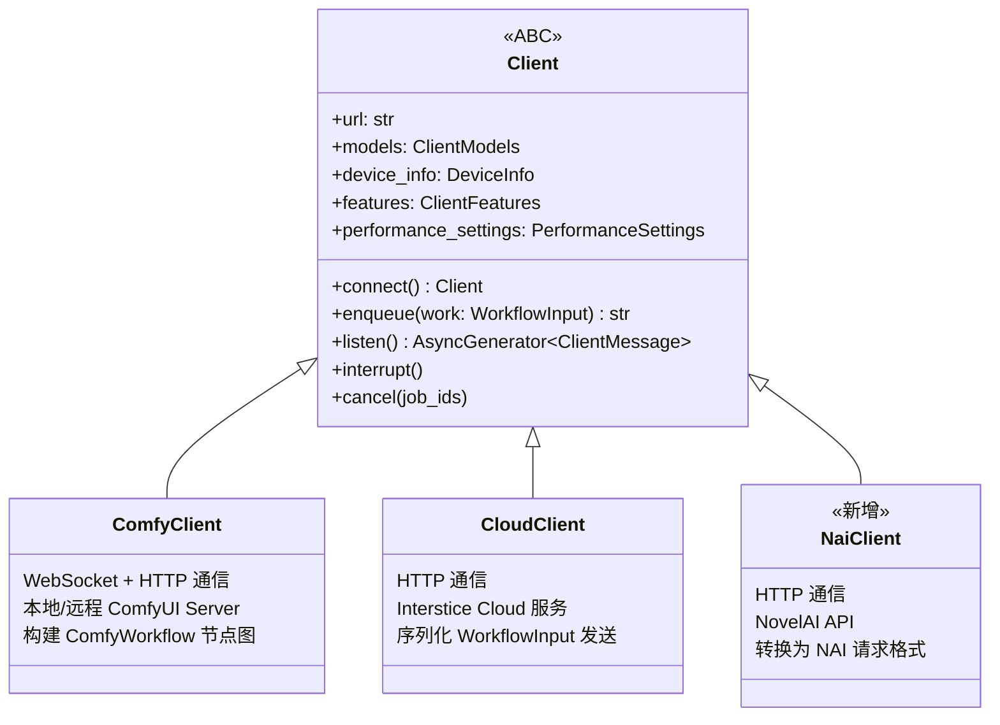
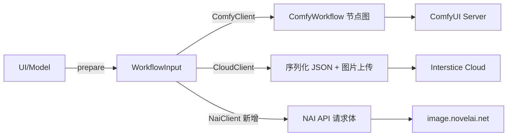

# NovelAI 后端集成架构方案

## 一、现有架构理解

### 1.1 后端抽象层

项目已经有一个清晰的后端抽象体系：



- [`Client`](ai_diffusion/client.py:407) 是抽象基类，定义了 `connect()`, `enqueue()`, `listen()`, `interrupt()`, `cancel()` 等核心方法
- [`ComfyClient`](ai_diffusion/comfy_client.py:139) — 本地/远程 ComfyUI server（WebSocket + HTTP）
- [`CloudClient`](ai_diffusion/cloud_client.py:81) — Interstice Cloud 服务（HTTP 轮询）

### 1.2 数据流



- [`WorkflowInput`](ai_diffusion/api.py:188) 是后端无关的中间表示，包含 `kind`, `images`, `models`, `sampling`, `conditioning`, `inpaint` 等字段
- [`workflow.prepare()`](ai_diffusion/workflow.py:1626) 从 UI 状态构建 `WorkflowInput`
- [`workflow.create()`](ai_diffusion/workflow.py:1773) 将 `WorkflowInput` 转换为 ComfyUI workflow（仅 ComfyClient 使用）
- `CloudClient` 直接序列化 `WorkflowInput` 发送到 cloud

### 1.3 连接管理

[`Connection`](ai_diffusion/connection.py:34) 类管理后端连接：

- 根据 [`ServerMode`](ai_diffusion/settings.py:18)（`managed` / `external` / `cloud`）选择创建 `ComfyClient` 或 `CloudClient`
- 处理认证流程、消息监听、状态管理

### 1.4 关键发现

1. **`WorkflowInput` 是后端无关的** — 但它的字段（如 `models.checkpoint`, `sampling.sampler`）是面向 ComfyUI 生态设计的
2. **`CloudClient` 是最接近的参考** — 它也是云端 API，不需要本地 server，也是 HTTP 通信
3. **`workflow.prepare()` 耦合了 ComfyUI 概念** — 它依赖 `ClientModels`（checkpoint 列表等），NAI 不需要这些
4. **NAI 和 ComfyUI 的根本差异**：
   - NAI 不需要 checkpoint/lora/vae 管理
   - NAI 有自己的参数体系（`sm`/`sm_dyn`, `ucPreset`, `noise_schedule` 等）
   - NAI 的 inpaint 不需要客户端裁剪/拼接
   - NAI 返回的是 zip 文件而非 WebSocket 消息

---

## 二、改动方案

### 2.1 核心原则

1. **NAI 后端作为第三种 `Client` 实现**，与 `ComfyClient`/`CloudClient` 并列
2. **不改动 `workflow.py`** — 那是 ComfyUI 专用的 workflow 构建逻辑
3. **NAI 有独立的"prepare"逻辑** — 因为 NAI 参数体系完全不同，不复用 `workflow.prepare()`
4. **最小侵入现有代码** — 主要修改 `connection.py`（添加 NAI 选项）和 `settings.py`（添加 NAI 配置）

### 2.2 新增文件

| 文件 | 职责 |
|------|------|
| `ai_diffusion/nai_client.py` | NAI 的 `Client` 实现，HTTP 通信、任务管理 |
| `ai_diffusion/nai_workflow.py` | NAI 参数准备逻辑：将 UI 状态转换为 NAI API 请求体 |

### 2.3 修改现有文件

| 文件 | 改动 |
|------|------|
| `ai_diffusion/settings.py` | `ServerMode` 枚举新增 `nai`；新增 `nai_api_key` 设置 |
| `ai_diffusion/connection.py` | `_connect()` 方法新增 NAI 分支 |
| `ai_diffusion/model.py` | 生成任务入口增加 NAI 后端分支（prepare 逻辑） |
| `ai_diffusion/style.py` | NAI 相关的 Style 参数（quality tags, UC preset 等）|

### 2.4 详细设计

#### 2.4.1 `settings.py` 修改

```python
class ServerMode(Enum):
    undefined = -1
    managed = 0
    external = 1
    cloud = 2
    nai = 3  # 新增

# 新增设置
nai_api_token: str
_nai_api_token = Setting("NovelAI API Token", "")
```

#### 2.4.2 `nai_client.py` — NAI Client 实现

```python
class NaiClient(Client):
    """NovelAI Image Generation API client."""

    api_url = "https://image.novelai.net"

    @staticmethod
    async def connect(url: str, access_token: str = "") -> NaiClient:
        # 验证 API token
        # 不需要 discover models —— NAI 模型是固定的
        ...

    async def enqueue(self, work: WorkflowInput, front=False) -> str:
        # 将 WorkflowInput 转换为 NAI API 请求
        # 调用 /ai/generate-image
        # 返回 job ID
        ...

    async def listen(self) -> AsyncGenerator[ClientMessage, Any]:
        # 类似 CloudClient，用内部消息队列分发事件
        ...

    # models 属性返回一个简化的 ClientModels
    # - 固定的 checkpoint 列表（nai-diffusion-3, nai-diffusion-4-curated 等）
    # - 不需要 lora/vae/upscaler
```

**关键实现细节：**

- **认证**: `Authorization: Bearer pst-xxx` header
- **请求格式**: JSON body → `image.ImageGenerationRequest`
- **响应格式**: `application/zip` 包含生成的图片
- **图片编码**: base64 编码的 PNG
- **Vibe Transfer**: 使用 `/ai/encode-vibe` 预编码参考图

#### 2.4.3 `nai_workflow.py` — NAI 参数准备

这个模块负责将插件的 UI 状态转换为 NAI API 的请求参数：

```python
def prepare_nai_generate(
    prompt: str,
    negative_prompt: str,
    width: int,
    height: int,
    # NAI 特有参数
    model: str = "nai-diffusion-4-curated-preview",
    quality_tags: bool = True,
    uc_preset: int = 0,  # Heavy=0, Light=1, None=2
    sampler: str = "k_euler",
    steps: int = 28,
    scale: float = 5.0,
    cfg_rescale: float = 0.0,
    noise_schedule: str = "native",
    sm: bool = False,
    sm_dyn: bool = False,
    seed: int = 0,
    # img2img
    image: str | None = None,      # base64
    strength: float = 0.7,
    noise: float = 0.0,
    # inpaint
    mask: str | None = None,       # base64
    # vibe transfer
    reference_images: list[str] | None = None,
    reference_strengths: list[float] | None = None,
    reference_information_extracted: list[float] | None = None,
) -> dict:
    """构建 NAI API 请求体"""
    ...

def convert_from_workflow_input(work: WorkflowInput, nai_settings: dict) -> dict:
    """将 WorkflowInput 转换为 NAI API 请求参数"""
    # 从 WorkflowInput 提取通用参数
    # 映射 sampler 名称
    # 处理图片编码
    ...
```

**NAI 模型列表**（硬编码）:
- `nai-diffusion-4-curated-preview` (V4 Curated)
- `nai-diffusion-4-full` (V4 Full)  
- `nai-diffusion-3` (V3/Anime V3)

**NAI Sampler 映射**:
| 插件 Sampler | NAI Sampler |
|-------------|-------------|
| euler | k_euler |
| euler_ancestral | k_euler_ancestral |
| dpmpp_2m | k_dpmpp_2m |
| dpmpp_2m_sde | k_dpmpp_2m_sde |
| dpmpp_sde | k_dpmpp_sde |
| ddim | ddim_v3 |

#### 2.4.4 `connection.py` 修改

在 [`_connect()`](ai_diffusion/connection.py:84) 方法中新增 NAI 分支：

```python
async def _connect(self, url: str, mode: ServerMode, access_token=""):
    ...
    if mode is ServerMode.cloud:
        ...
    elif mode is ServerMode.nai:
        if access_token == "":
            # 需要 NAI API token
            self.state = ConnectionState.auth_missing
            return
        self._client = await NaiClient.connect(NaiClient.api_url, access_token)
        # NAI 不需要 discover_models
    else:
        self._client = await ComfyClient.connect(url, access_token)
        ...
```

#### 2.4.5 `model.py` 修改

在生成任务入口处，判断当前后端类型，选择不同的 prepare 逻辑：

```python
# 在 _generate() 或相关方法中
if isinstance(client, NaiClient):
    # 使用 nai_workflow 的 prepare 逻辑
    work = nai_workflow.prepare_from_ui_state(...)
else:
    # 使用现有的 workflow.prepare() 逻辑
    work = workflow.prepare(...)
```

### 2.5 NAI Inpaint 处理

NAI 的 inpaint 与 ComfyUI 有重要差异：

1. **NAI 读取整张图片上下文** — 不需要客户端裁剪到 mask 区域
2. **NAI 的 action 字段** — `"img2img"` 用于 img2img，`"infill"` 用于 inpaint
3. **mask 格式** — base64 编码的图片，白色区域为需要重绘的区域

因此 NAI 后端需要**跳过**现有 inpaint 流程中的：
- `resolution.prepare_image()` 的裁剪逻辑
- `InpaintParams` 的 grow/feather/blend 处理
- 所有 ComfyUI 特有的 fill_masked / differential_diffusion 等

NAI inpaint 的流程简化为：
1. 将完整画布图片 base64 编码
2. 将 mask 图片 base64 编码
3. 设置 `action: "infill"`, 附带 image 和 mask
4. 直接返回重绘后的区域图片

### 2.6 VibeTransfer 实现

NAI 的 VibeTransfer 对应 ComfyUI 生态的 IP-Adapter / Reference：

1. **编码阶段**: 调用 `/ai/encode-vibe` 预编码参考图（可选，也可直接传 base64 图片）
2. **生成阶段**: 在请求参数中设置 `reference_image`/`reference_image_multiple`, `reference_strength`, `reference_information_extracted`

映射关系：
- 插件 UI 的 "Reference/Style" control → NAI 的 `reference_image`
- control.strength → `reference_strength`
- 新增 "Information Extracted" 滑块 → `reference_information_extracted`

---

## 三、执行阶段划分

### Phase 1: NAI Client 核心
- 新增 `nai_client.py` — 实现 `Client` ABC
- 新增 `nai_workflow.py` — NAI 参数准备
- 实现认证、基本的 HTTP 通信

### Phase 2: 连接与配置
- 修改 `settings.py` — 新增 `ServerMode.nai`, `nai_api_token`
- 修改 `connection.py` — 添加 NAI 连接分支
- 修改 `_handle_settings_changed` 处理 NAI 模式切换

### Phase 3: 文生图
- 实现 `NaiClient.enqueue()` → `/ai/generate-image`
- 实现 zip 响应解析
- 修改 `model.py` 入口，NAI 后端使用 `nai_workflow.prepare_generate()`

### Phase 4: 图生图
- 在 `nai_workflow.py` 中实现 img2img 参数准备
- 处理图片 base64 编码
- 设置 `action: "img2img"`, `strength`, `noise`

### Phase 5: 局部重绘
- 实现 NAI inpaint（`action: "infill"`）
- **跳过** ComfyUI 特有的裁剪/拼接步骤
- NAI 接收全图 + mask，返回结果后客户端只需简单合成

### Phase 6: VibeTransfer
- 实现 `/ai/encode-vibe` 调用
- 在生成请求中附加 reference 参数
- 映射插件的 Reference control 到 NAI 参数

### Phase 7: UI 控件
- NAI 模型选择下拉框（替代 checkpoint 选择）
- Quality Tags 开关
- Undesired Content Preset（Heavy / Light / None）
- SMEA / SMEA+DYN 开关
- Noise Schedule 选择
- Information Extracted 滑块（VibeTransfer）
- V4 Prompt 结构支持（character captions / coordinates）

### Phase 8: 测试与回顾
- 确认不影响 ComfyUI / Cloud 后端
- 端到端测试所有功能
- 代码审查，确认符合项目编码规范

---

## 四、文件影响范围总结

### 新增文件（2个）
| 文件 | 行数估计 |
|------|---------|
| `ai_diffusion/nai_client.py` | ~400 行 |
| `ai_diffusion/nai_workflow.py` | ~300 行 |

### 修改文件（4-5个）
| 文件 | 改动范围 |
|------|---------|
| `ai_diffusion/settings.py` | ~10 行（新增枚举值 + 设置项）|
| `ai_diffusion/connection.py` | ~20 行（新增 NAI 连接分支）|
| `ai_diffusion/model.py` | ~30 行（生成入口添加 NAI 分支）|
| `ai_diffusion/style.py` | ~20 行（NAI 特有 style 参数，可选）|
| `ai_diffusion/resources.py` | ~5 行（NAI 模型 Arch 枚举，如果需要）|

### 不改动的文件
- `ai_diffusion/workflow.py` — ComfyUI 专用，不触碰
- `ai_diffusion/comfy_client.py` — 不影响
- `ai_diffusion/comfy_workflow.py` — 不影响
- `ai_diffusion/cloud_client.py` — 不影响
- `ai_diffusion/api.py` — 尽量不改动（`WorkflowInput` 结构保持不变）

---

## 五、风险与注意事项

1. **API Token 安全** — NAI API token (`pst-xxx`) 的存储方式应与现有 `access_token` 一致，存在 settings.json 中
2. **NAI API 限流** — NAI API 有速率限制，需要处理 429 响应
3. **图片大小限制** — NAI 对分辨率有特定要求（如宽高需为64的倍数），需要在 `nai_workflow.py` 中做规整
4. **V4 Prompt 结构** — NAI V4 模型支持结构化 prompt（`v4_prompt` with `char_captions`），这是一个高级特性，可以在后续迭代中实现
5. **流式生成** — NAI 支持 SSE 流式响应（`/ai/generate-image-stream`），初期可先用普通请求，后续迭代加入流式支持
